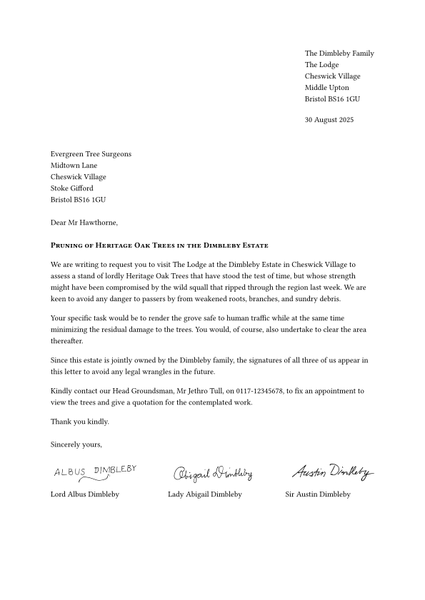

# The `letterloom` Package
<!-- markdownlint-disable MD033 -->
<div align="center">Version 0.1.0</div>

A Typst template for writing letters containing multiple signatures, figures, footnotes and enclosures.

## Template adaptation checklist

- [ ] Fill out `README.md`
  - Change the `my-package` package name, including code snippets
  - Check section contents and/or delete sections that don't apply
- [x] Check and/or replace `LICENSE` by something that suits your needs
- [x] Fill out `typst.toml`
  - See also the [typst/packages README](https://github.com/typst/packages/?tab=readme-ov-file#package-format)
- [ ] Adapt Repository URLs in `CHANGELOG.md`
  - Consider only committing that file with your first release, or removing the "Initial Release" part in the beginning
- [ ] Adapt or deactivate the release workflow in `.github/workflows/release.yml`
  - to deactivate it, delete that file or remove/comment out lines 2-4 (`on:` and following)
  - to use the workflow
    - [ ] check the values under `env:`, particularly `REGISTRY_REPO`
    - [ ] if you don't have one, [create a fine-grained personal access token](https://github.com/settings/tokens?type=beta) with [only Contents permission](https://stackoverflow.com/a/75116350/371191) for the `REGISTRY_REPO`
    - [ ] on this repo, create a secret `REGISTRY_TOKEN` (at `https://github.com/[user]/[repo]/settings/secrets/actions`) that contains the so created token

    if configured correctly, whenever you create a tag `v...`, your package will be pushed onto a branch on the `REGISTRY_REPO`, from which you can then create a pull request against [typst/packages](https://github.com/typst/packages/)
- [ ] remove/replace the example test case
- [ ] (add your actual code, docs and tests)
- [ ] remove this section from the README

## Getting Started

These instructions will get you a copy of the project up and running on the Typst web app.

```typ
#import "@preview/letterloom:0.1.0": *

#show: letterloom.with(
  from: (
    name: "The Dimbleby Family",
    address: [The Lodge \
              Cheswick Village \
              Middle Upton \
              Bristol BS16 1GU]
  ),
  to: (
    name: "Evergreen Tree Surgeons",
    address: [Midtown Lane \
              Cheswick Village \
              Stoke Gifford \
              Bristol BS16 1GU]
  ),
  date: datetime.today().display("[day padding:zero] [month repr:long] [year repr:full]"),
  salutation: "Gentlemen,",
  subject: "Pruning of Heritage Oak Trees in the Dimbleby Estate",
  closing: "Sincerely yours,",
  signatures: (
    (
      name: "Lord Albus Dimbleby",
      signature: image("../images/albus-sig.png")
    ),
    (
      name: "Lady Abigail Dimbleby",
      signature: image("../images/abigail-sig.png")
    ),
    (
      name: "Sir Austin Dimbleby",
      signature: image("../images/austin-sig.png")
    )
  )
)

We are writing to request you to visit The Lodge at the Dimbleby Estate in Cheswick Village to assess a stand of lordly Heritage Oak Trees that have stood the test of time, but whose strength might have been compromised by the wild squall that ripped through the region last week. We are keen to avoid any danger to passers by from weakened roots, branches, and sundry debris.

Your specific task would be to render the grove safe to human traffic while at the same time minimizing the residual damage to the trees. You would, of course, also undertake to clear the area thereafter.

Since this estate is jointly owned by the Dimbleby family, the signatures of all three of us appear in this letter to avoid any legal wrangles in the future.

Kindly contact our Head Groundsman, Mr Jethro Tull, on 0117-12345678. to fix an appointment to view the trees and give a quotation for the contemplated work.

Thank you kindly.
```

<picture>
  <source media="(prefers-color-scheme: dark)" srcset="./thumbnail-dark.svg">
  
</picture>

### Installation

Follow these steps to set up your development environment and prepare for contributing to the project:

**Typst:** Install Typst (version 0.13.0 or higher) using the official installation instructions. Typst is required to work with the core functionality of the project.

**Just:** Install Just, a handy command runner for executing predefined tasks. You can install it using a package manager or by downloading a pre-built binary. Refer to the available packages for installation instructions specific to your operating system.

**tytanic:** Install tytanic, a library essential for testing and working with Typst projects. Use the quickstart installation guide to get it up and running.

**Clone the Repository:** Download the project's source code by cloning the repository to your local machine:

```bash
git clone https://github.com/nandac/letterloom.git
```

Once you've completed these steps, your development environment will be ready.

### Next Steps

The `letterloom` package source code is located at:

```plaintext
src/lib.typ
```

This is where you will make any necessary changes to the module.

### Running Tests

To test the functionality of the module locally, run the predefined test cases using the following command:

```bash
just test
```

Ensure that all tests pass before submitting any changes to maintain the project's integrity.

If you want to test the module with a Typst file, you can install the `letterloom` package locally in the `preview` location by running:

```bash
just install-preview
```

Once installed, you can import the package into your Typst file using the following statement:

```typ
#import "@preview/letterloom:0.1.0": *
```

This setup allows you to experiment with the module in a Typst file before finalizing your changes.

## Usage

For a comprehensive overview of all available options and a detailed, full-featured example, we recommend consulting the package's official manual. The manual provides an explanation of each option, and an example of how set it to help you get started using the package.

## Acknowledgments

Special thanks to the Typst community on [Discord](https://discord.com/channels/1054443721975922748/1069937650125000807) for their invaluable assistance and support during the development of this package.
